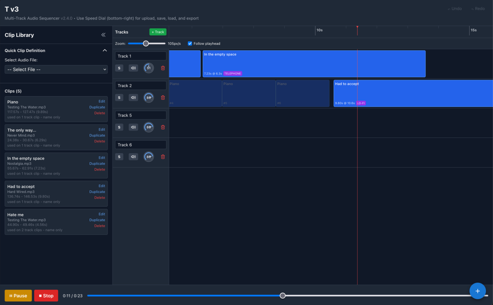

# Massembler - Multi-Track Audio Sequencer

A web-based multi-track audio sequencer that allows you to upload audio files, create clips from selected portions, and arrange them across multiple tracks with full playback control, project management, and audio export capabilities.

**▶ [Try it live](https://jeanlazarou.github.io/mazy-suite/massembler/)** — part of the [Mazy Suite](https://jeanlazarou.github.io/mazy-suite/). Everything runs in the browser; no audio is uploaded anywhere.



## 🎉 Major Features

### Core Editing Features
- **Audio File Upload**: Any format the browser can decode (WAV, MP3, M4A, FLAC…), via Material UI Speed Dial
- **Waveform Visualization**: Visual representation of audio with interactive selection
- **Advanced Waveform Editor**:
  - Large popup modal for precise waveform editing
  - Audio preview playback for selected regions
  - Better visualization for creating clips
- **Adjustable Selections**: A region stays put until you commit it
  - Drag either green edge to move that bound, with the other anchored
  - Drag the middle to slide the whole region
  - A stray click no longer discards the selection
  - Creating the clip is an explicit action
- **Clip Library**: Create and manage audio clips from uploaded files (collapsible sidebar)
- **Editable Clips**: Clips are not write-once
  - A clip nothing references can have its region and name changed
  - A clip already placed on a track has its region locked (changing it would
    shift audio arranged on the timeline) and only its name can change
  - The library row shows how many track clips use it
- **Duplicate Clips**: Copy a clip's region into a new library entry, named
  `<name> copy`, as a starting point for a variation. Track placements stay
  with the original.
- **Multi-Track Timeline**: Arrange clips across multiple tracks
- **Drag & Drop**:
  - Easy placement of clips from library to tracks
  - Drag to reposition clips within tracks
  - Drag clips between different tracks
  - Custom drag preview showing clip appearance

### Advanced Editing
- **Clip Resizing**: Adjust clip length by dragging left or right edges
  - Each clip instance can be trimmed independently
  - Left edge resize moves the clip position for intuitive editing
- **Repeat Functionality**: Mark clips to repeat with configurable repeat count
  - Visual phantom clips show where repetitions will play
  - Can be disabled by setting count to 1
- **Fades**: Per-clip fade in/out, draggable directly on the clip's waveform
- **Clip Effects**: One-click treatments applied per track clip, no parameters to tune
  - **Reverse** — plays the clip backwards
  - **Underwater** — muffled, slowly wobbling
  - **Telephone** — thin, bandlimited, slightly crunchy
  - **Cathedral** — long reverberant tail
  - **Distant** — dulled and set back, as if through a wall
  - **Tremolo** — level pulsing at a steady rate
  - **Lo-fi** — coarsely quantised and dulled
  - **Deep** — slowed down and pitched below the original
  - Playback and export share one implementation, so the exported WAV matches
    what you hear; reverb tails are given room rather than being cut off
- **Undo/Redo**: Comprehensive history system supporting:
  - Adding/removing clips from library
  - Adding/removing clips from tracks
  - Moving clips within tracks
  - Moving clips between tracks
  - Resizing clips
  - Deleting tracks
  - Keyboard shortcuts (Ctrl+Z / Cmd+Z for undo, Ctrl+Shift+Z / Cmd+Shift+Z for redo)

### Track Controls
- **Volume Knob**: Rotary control with an arc and centred value
  - Drag up/down to turn it — grabbing it never jumps the value
  - Mouse wheel, and arrow / Page / Home / End keys when focused
  - Hold `Shift` for fine adjustment, double-click to restore the default
- **Mute/Unmute**: Toggle with visual icons (speaker with/without X)
- **Solo**: Hear only the tracks you are working on
  - Additive: solo as many tracks as you like and hear that group together
  - Tracks silenced by someone else's solo are dimmed, so a quiet track never
    looks like a broken one
  - Mute wins over solo, so soloing a group never resurrects a track you had
    deliberately taken out
  - Applies to Export Mix too: what you hear is what gets rendered
- **Add/Remove Tracks**: Flexible track management
- **Rename Tracks**: Click track name to edit

### Playback
- **Play, Pause, Stop**: Full playback controls
- **Playhead**: A line across the ruler and every track showing where playback
  has reached
- **Follow Playhead**: Optionally scrolls the timeline to keep the playhead in
  view, jumping a page at a time so waveforms stay readable
  - Scrolling by hand while playing turns following off, so it never fights you
  - Disabled, and marked *(not needed)*, while the whole arrangement already
    fits on screen
- **Timeline Scrubbing**: Jump to any position
- **Real-time Progress**: Visual playback position display
- **Timeline Zoom**: Adjust scale for precision editing

### Project Management
- **Export Mix** 🎵: Render all tracks to a single WAV file
  - Uses `OfflineAudioContext` for offline rendering
  - Respects track volumes and mute states
  - Handles clip trimming and repeats correctly
  - Shows real-time progress during export
  - Downloads as `[ProjectName]-mix.wav`

- **Save Project** 💾: Save complete project as `.mass` file (ZIP format)
  - Contains `project.json` with all state (tracks, clips, positions, trim values, volumes, etc.)
  - Includes `audio/` folder holding each file **in its original encoding**
  - An MP3-sourced project stays MP3-sized instead of being re-encoded to PCM
  - Progress indicator during save
  - Downloads as `[ProjectName].mass`

- **Optimize Project** 🗜️: Trim audio down to the regions clips actually use
  - Lists every audio file with exact byte counts, ranked by absolute saving
  - Sizes are computed, not estimated: the archive stores uncompressed PCM
  - Savings can be **negative** — re-encoding a trimmed compressed file to PCM
    often costs more than it saves, so those are flagged and never preselected
  - Unused audio files are dropped entirely
  - Keeps a margin around each region so clip edges stay resizable
  - Writes a copy; the project you have open is left untouched
  - **Relink** points an optimized file back at its original recording, expanding
    every clip time back as it goes

- **Load Project** 📂: Load `.mass` files and completely restore state
  - Extracts and decodes all audio files
  - Restores tracks, clips, trim values, positions, repeats, etc.
  - Progress indicator during load
  - Everything works exactly as it did before save

### UI/UX Features
- **Material UI Speed Dial**: Beautiful floating action button (bottom-right) with:
  - 📁 Upload Audio
  - 📂 Load Project
  - 💾 Save Project
  - 🗜️ Optimize Project
  - 🎵 Export Mix
- **Collapsible Clip Library**: Hide the whole sidebar down to a narrow rail
  when you are arranging rather than defining clips, giving the timeline the
  space back. The rail keeps the clip count in view and reopens on a click.
- **Collapsible Quick Clip Definition**: Save space in sidebar when not needed
- **Editable Project Name**: Click title in header to rename project
- **Version in the header**: Shows which build is running, so a stale cached
  page is easy to spot
- **Progress Indicators**: All long-running operations show progress bars with percentages
- **Toast Notifications**: Failures and confirmations appear as dismissible toasts
  rather than blocking browser dialogs; failures stay until dismissed so their
  detail can be read

## Getting Started

### Prerequisites

- Node.js (v18 or higher recommended)
- pnpm (the suite uses pnpm workspaces)

### Installation

1. Clone the repository:
```bash
git clone <repository-url>
cd massembler
```

2. Install dependencies:
```bash
pnpm install
```

3. Start the development server:
```bash
pnpm dev
```

4. Open your browser and navigate to `http://localhost:5173`

## 🎮 How to Use

### 1. Upload Audio Files

Click the **Speed Dial** button (the blue **+** at the bottom-right) → **Upload Audio** → select one or more audio files.

### 2. Create Clips

**Option A: Quick Selection (in sidebar)**
1. Expand "Quick Clip Definition" section if collapsed
2. Select an audio file from the dropdown
3. Click and drag on the waveform to select a region
4. Fine-tune it: drag either green edge to move that bound, or drag the middle
   to slide the whole region. The selection survives clicks elsewhere.
5. Enter a name for your clip
6. Click "Create Clip"

**Option B: Advanced Editor (recommended)**
1. Select an audio file from the dropdown
2. Click "Open Waveform Editor" button
3. Use the large waveform display to precisely select a region
4. Drag the green edges to adjust; `Shift`+drag pans, `Alt`+drag moves the whole
   selection, and the mouse wheel zooms
5. Click "Play Selection" to preview your selection
6. Enter a name for your clip
7. Click "Create Clip"

Once your clips are defined, collapse the library with the **«** button in its
header — it shrinks to a rail on the left and hands the width to the timeline.
Click the rail to bring it back.

### 2b. Edit a Clip

Click **Duplicate** on a clip to copy its region into a new library entry —
useful as a starting point when you want a variation on a region you already
found. The copy is independent: it can be edited freely, and the original keeps
its track placements.

Click **Edit** on any clip in the library. If nothing references the clip yet you
can change its region and its name. Once it has been placed on a track the region
is locked — changing it would move audio already arranged on the timeline — and
only the name can be edited. The row tells you which case applies.

### 3. Arrange Clips on Tracks

1. Drag a clip from the library onto a track
2. Drop it at the desired position on the timeline
3. **Reposition**: Drag clip blocks left or right to move them
4. **Move Between Tracks**: Drag clips up or down to different tracks
5. **Resize Clips**: Hover over clip edges and drag left/right edge to adjust trim
   - Each instance can be resized independently
   - Left edge resize moves the clip position for intuitive editing
6. Click a clip block to open its properties panel below the timeline:
   - Pick a one-click **effect** (reverse, underwater, cathedral, …)
   - Set fade in/out, either numerically or by dragging the green/red handles
     on the clip's waveform
   - Toggle repeat on/off and adjust the repeat count (set to 1 to disable)
   - Delete it from the track

   Clips carrying an effect show a badge on the timeline block.

### 4. Control Tracks

- **Volume**: Rotate the volume knob (shows value in center)
- **Mute**: Click the speaker icon to mute/unmute a track
- **Solo**: Click **S** to hear only that track. Solo several tracks to hear
  just that group — the rest dim to show they are being held silent. Click **S**
  again to release. Solo state is saved with the project, so a project saved
  while soloing reopens that way.
- **Rename**: Click on the track name to edit it
- **Add Track**: Click the "+ Track" button to add a new track
- **Remove Track**: Click the trash icon to remove a track

### 5. Playback

- **Play**: Start playback from the current position
- **Pause**: Pause playback (can be resumed)
- **Stop**: Stop playback and return to the beginning
- **Seek**: Drag the timeline scrubber to jump to a specific position
- **Zoom**: Adjust the timeline zoom level for better precision
- **Follow the playhead**: A red line tracks playback across the ruler and
  tracks. Tick **Follow playhead** (next to the zoom slider) and the view
  scrolls to keep it visible once it would otherwise run off the right-hand
  edge. On a short arrangement the playhead never leaves the screen, so the
  option stays disabled and marked *(not needed)* until you zoom in or arrange
  further along.

### 6. Undo/Redo

- **Undo**: Click the "Undo" button or press Ctrl+Z (Cmd+Z on Mac)
- **Redo**: Click the "Redo" button or press Ctrl+Shift+Z (Cmd+Shift+Z on Mac) or Ctrl+Y (Cmd+Y on Mac)
- Supports undoing all major operations:
  - Adding/removing clips
  - Adding/removing tracks
  - Moving clips within tracks
  - Moving clips between tracks
  - Resizing clips
  - Deleting tracks

### 7. Save and Export

**Save Your Work**:
- Click Speed Dial → **Save Project**
- Downloads a `.mass` file containing your complete project

**Load Saved Project**:
- Click Speed Dial → **Load Project**
- Select a `.mass` file to restore your work

**Export Final Mix**:
- Click Speed Dial → **Export Mix**
- Renders all tracks to a single WAV file, effects and fades included
- Downloads as `[ProjectName]-mix.wav`

**Shrink a Project**:
- Click Speed Dial → **Optimize Project**
- Review the per-file savings, tick the files worth trimming, and save the copy
- Rows shown in red would *grow* the project: their audio is already compressed,
  and trimming it means storing PCM instead

## 📦 Technical Stack

- **React 18**: UI framework with hooks
- **TypeScript**: Type-safe development
- **Vite**: Fast build tool and dev server
- **Zustand**: Lightweight state management with undo/redo
- **Tailwind CSS**: Utility-first styling
- **Material UI**: Modern UI components (Speed Dial, icons)
- **Web Audio API**: Audio playback and processing
- **JSZip**: Project file compression and management

### Key Technical Features
- **OfflineAudioContext**: High-quality audio rendering for export
- **AudioBuffer Management**: Efficient in-memory audio handling
- **Shared Effect Chains**: One implementation drives both realtime playback and
  offline rendering, so exports match what you hear
- **Custom Drag & Drop**: Enhanced drag preview with visual feedback
- **ResizeObserver**: Responsive waveform rendering
- **WAV Encoding**: Client-side WAV file generation
- **ZIP Archive**: Project files packaged as `.mass` (ZIP format)

## Project Structure

```
massembler/
├── src/
│   ├── components/
│   │   ├── Waveform.tsx            # Waveform with adjustable selection
│   │   ├── ClipLibrary.tsx         # Clip management (collapsible)
│   │   ├── WaveformEditorModal.tsx # Advanced waveform editor / clip editor
│   │   ├── Timeline.tsx            # Multi-track timeline
│   │   ├── Track.tsx               # Individual track component
│   │   ├── TrackClipBlock.tsx      # Clip block with resize/repeat
│   │   ├── ClipPropertiesPanel.tsx # Per-clip effects, fades and repeats
│   │   ├── VolumeKnob.tsx          # Rotary volume control
│   │   ├── PlaybackControls.tsx    # Playback UI
│   │   ├── UndoRedoControls.tsx    # Undo/redo UI
│   │   ├── ToastContainer.tsx      # Non-blocking notifications
│   │   ├── OptimizeDialog.tsx      # Per-file savings and relinking
│   │   └── ProjectActions.tsx      # Speed Dial for save/load/export
│   ├── utils/
│   │   ├── audioEngine.ts          # Web Audio API engine
│   │   ├── clipEffects.ts          # Preset effect chains, shared by
│   │   │                           #   playback and export
│   │   ├── clipTiming.ts           # How long a track clip occupies
│   │   ├── projectOptimizer.ts     # Trim analysis, remapping, relinking
│   │   ├── undoRedo.ts             # Undo/redo manager
│   │   └── projectManager.ts       # Save/load/export logic
│   ├── types.ts                    # TypeScript interfaces
│   ├── store.ts                    # Zustand state management
│   ├── App.tsx                     # Main app component
│   ├── main.tsx                    # Entry point
│   └── index.css                   # Global styles
├── index.html
├── package.json
├── tsconfig.json
├── vite.config.ts
└── tailwind.config.js
```

## File Format

### .mass Project Files

Project files use the `.mass` extension and are standard ZIP archives containing:

```
project.mass (ZIP file)
├── project.json          # Project metadata and state
└── audio/
    ├── [audioId1].mp3    # stored in whatever encoding it arrived as
    ├── [audioId2].wav
    └── ...
```

Audio is stored in its **source encoding** rather than re-encoded to PCM, which
keeps projects close to the size of the files they were built from. Trimmed
(optimized) audio has no original encoding left, so it is written as WAV.

**project.json structure:**
```json
{
  "version": 3,
  "name": "My Project",
  "tracks": [...],           // All tracks with clips
  "clips": [...],            // All clip definitions
  "audioFiles": [...],       // Audio file metadata
  "pixelsPerSecond": 50      // Timeline zoom level
}
```

Each entry in `audioFiles` names the file that holds it inside the archive, and
optimized files additionally record what was kept:

```json
{
  "id": "audio-1",
  "name": "drums.mp3",
  "duration": 182.4,
  "storedFile": "audio-1.mp3",
  "optimization": {
    "originalName": "drums.mp3",
    "originalDuration": 182.4,
    "segments": [{ "start": 8, "end": 14 }, { "start": 47, "end": 55 }]
  }
}
```

`segments` are in original-recording time, and the stored audio is those
segments concatenated in order — which is what lets **Relink** map clip times
back onto the full recording.

### Format versions

`version` is a number and is checked on load; an unrecognised value is refused
rather than half-loaded.

| Version | Change |
| ------- | ------ |
| 1 | Audio always stored as `<id>.wav` (decoded PCM) |
| 2 | Audio stored in its source encoding, named by `storedFile` |
| 3 | Audio may be trimmed to used regions, described by `optimization` |

Only the current version is readable — earlier ones were never released.

The `.mass` format is compatible with standard ZIP tools, so you can inspect or manually edit projects if needed.

## Development

### Build for Production

```bash
pnpm build
```

The built files will be in the `dist/` directory.

### Preview Production Build

```bash
pnpm preview
```

### Linting

```bash
pnpm lint
```

## Browser Support

Modern browsers with Web Audio API support:
- Chrome/Edge 88+
- Firefox 85+
- Safari 14+

## License

MIT

## Contributing

Contributions are welcome! Please feel free to submit a Pull Request.

## Roadmap

Future feature ideas:
- Adjustable effect parameters, for when a preset is nearly right
- A pitched-*up* preset (needs a decision on reading past a clip's trim)
- Configurable optimizer margin, currently a fixed 2 seconds
- MIDI support
- Automation curves for volume/pan
- Collaborative editing
- More export formats (MP3, FLAC)
- Waveform caching for large files
