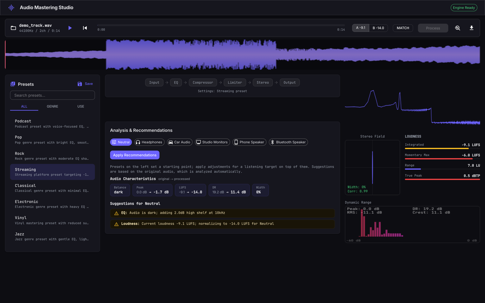
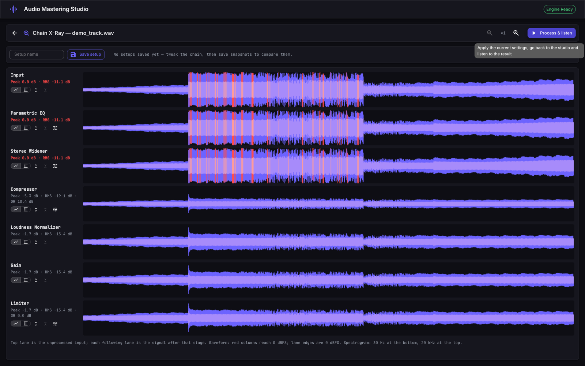
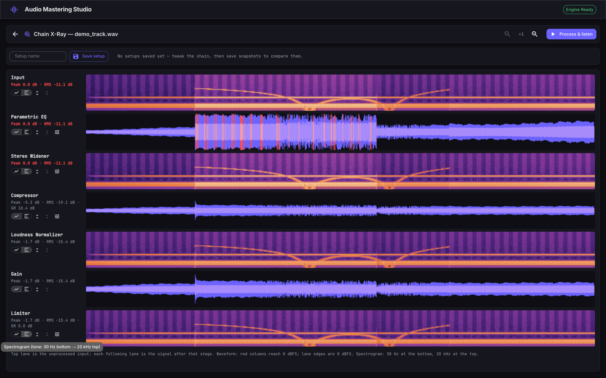

# Audio Mastering Studio

A professional audio mastering tool written in Go with a CLI and a React/WebAssembly web UI. Process audio through a configurable DSP chain (EQ, compression, limiting, stereo processing), analyze tracks, and get mastering recommendations tailored to target listening environments.



## Quick Start

```bash
# Build everything (CLI + WASM + Web UI)
./build.sh

# Process a file
./bin/master process input.wav -o output.wav --preset rock

# Analyze audio with target-specific recommendations
./bin/master analyze input.wav --target headphones

# List available presets
./bin/master preset list

# Launch the web UI
cd web && npx vite
```

## CLI Commands

| Command                                 | Description                                                  |
| ---------------------------------------- | ------------------------------------------------------------ |
| `master process <file> -o <out>`         | Process a single file through the mastering chain             |
| `master analyze <file> --target <t>`     | Analyze audio and get recommendations                          |
| `master preset list [--category genre]`  | List presets (filter by genre/target/usecase)                 |
| `master preset search <query>`           | Search presets by name, description, or tags                  |
| `master preset show <name>`              | Show preset details as JSON                                    |
| `master batch <dir> -o <outdir>`         | Process every file in a directory independently                |
| `master album <dir> -o <outdir>`         | Master a directory as one album: shared chain, loudness normalized by a single offset computed from the album's integrated loudness (preserves relative track levels) — use this instead of `batch` for related tracks |

### Process flags

- `-o, --output` — Output file path (required)
- `-p, --preset` — Preset name to apply
- `-b, --bit-depth` — Output bit depth (16, 24, 32; default: same as input)
- `-r, --sample-rate` — Output sample rate in Hz (default: same as input)
- `--eq`, `--comp`, `--limit` — Toggle individual processors

### Analyze targets

`headphones`, `car`, `studio`, `phone`, `bluetooth`

## Web UI

The web interface runs the Go DSP engine via WebAssembly in a Web Worker (so processing never blocks the UI). Features:

- Drag-and-drop file loading, single track or a whole album at once
- Album mastering: one shared chain and a single loudness offset across tracks, so relative levels are preserved instead of squashed flat
- Chain X-Ray: a full-screen workbench showing the signal at every stage of the chain as waveform or spectrogram lanes, with in-place processor editing (changes ripple through downstream lanes) and instant visual A/B between saved setups
- Loudness-matched A/B (original vs processed, trimmed to equal LUFS) and per-run gain-reduction stats
- Interactive EQ curve, knob controls for compressor/limiter/stereo
- Spectrum analyzer, waveform display, stereo field (Lissajous), LUFS meter
- Preset browser with search and filtering
- Analysis panel with per-target recommendations (aggregated across the album when more than one track is loaded)

### Chain X-Ray

A full-screen workbench: the signal at every stage of the chain as stacked lanes, switchable between waveform (dynamics — red where a stage hits 0 dBFS) and spectrogram (tone — 30 Hz to 20 kHz). Edit a processor in place and the change ripples through every lane downstream, so you can watch, for instance, the compressor swallow the clipping the EQ stage still shows.



Save the current settings as a named setup, tweak further, save another — clicking between setup chips flips every lane to that setup's captured state instantly, no reprocessing, so differences are a blink comparison rather than a diff you have to decode.



## DSP Chain

The full chain used by the web UI and CLI (`engine.NewFullChain`) runs in this order — the limiter stays last so its ceiling holds on the actual output:

1. **Parametric EQ** — 6-band (HPF, low shelf, 2× peak, high shelf, LPF)
2. **Bass Exciter** — Harmonic exciter isolating lows, generating harmonics audible on speakers that can't reproduce true sub-bass (disabled by default)
3. **Stereo Widener** — Mid/side width control
4. **Compressor** — Soft-knee with attack/release envelope
5. **Treble Exciter** — Harmonic exciter isolating highs, restoring presence gain reduction tends to dull (disabled by default)
6. **Loudness Normalizer** — LUFS-based normalization (disabled by default; the web UI enables it, the CLI enables it when a preset configures it)
7. **Gain** — Unity by default; carries the shared album loudness offset in album mastering
8. **Limiter** — Lookahead brickwall limiter, zero added latency

Both exciters start disabled — they add harmonic content that isn't in the source (a creative choice, not a corrective one) — and are switched on by the target-device recommendations (phone, bluetooth, car) or explicitly via their `enabled` param.

`pkg/dsp` also implements a Multiband Compressor, a (separate, unused) Harmonic Exciter, and a De-Esser — functional and tested, but not yet wired into any chain or preset.

## Supported Formats

| Format | Read | Write                     |
| ------ | ---- | ------------------------- |
| WAV    | Yes  | Yes                       |
| FLAC   | Yes  | Yes (requires `flac` CLI) |
| MP3    | Yes  | —                         |
| OGG    | Yes  | —                         |
| AIFF   | Yes  | —                         |

## Project Structure

```
cmd/master/       CLI application (cobra)
cmd/wasm/         WebAssembly entry point (syscall/js)
pkg/dsp/          DSP processors (all implement Processor interface)
pkg/engine/       Mastering engine / pipeline orchestration
pkg/io/           Audio file readers and writers
pkg/analysis/     Spectrum, dynamics, stereo, loudness analysis + recommendations
pkg/preset/       Preset system with go:embed built-ins
pkg/wasm/         JS↔Go bridge for WASM
web/              React + Vite + TypeScript + Material UI
```

## Building

Requires Go 1.21+ and Node.js 18+.

```bash
# Full build (tests + CLI + WASM + web)
./build.sh

# Tests only
go test ./pkg/... -v

# CLI only
go build -o bin/master ./cmd/master/

# WASM only
GOOS=js GOARCH=wasm go build -o web/public/engine.wasm ./cmd/wasm/
```